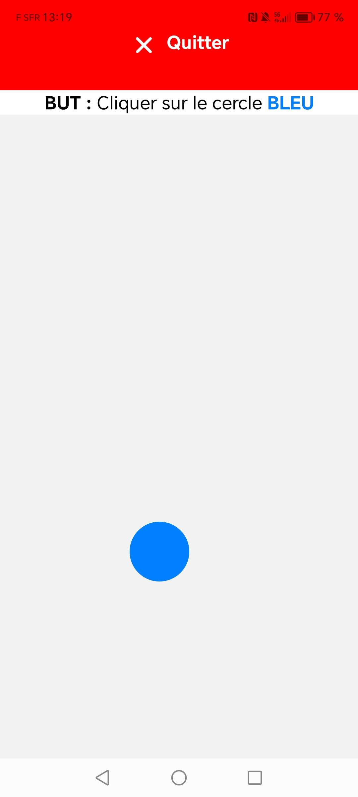
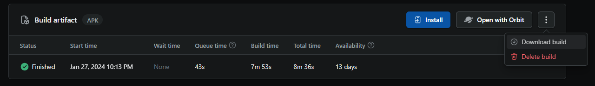

# Rehabilitation
## Description of the project
This mobile application is designed to enhance touch precision skills. The main functionality involves displaying circles at various positions on the screen of your phone or tablet. When a circle is tapped, it dynamically changes its location and size.

In the context of rehabilitating individuals with impaired motor skills, this app can offers a structured and goal-oriented activity. The repetitive nature of the task aims to stimulate and refine touch precision, contributing to the overall improvement of fine motor control.

  

Once install on the target device, you are ready to use it :
1. Open the application on your mobile device.
2. Tap on the displayed circles to see them dynamically change position and size.
3. Focus on improving your touch accuracy through repeated interactions.

To enhance accessibility for users with impaired motor skills, I've introduced a larger exit button to simplify the process of closing the application. This modification aims to streamline the experience, especially for individuals unfamiliar with basic device functionalities, for people who don't know how to do it du to impaired motor skills or facing precision challenges (so the target audience of the app). The substantial size of the button facilitates easier tapping for a smoother application exit.

## Prerequisites
- Make sure you have Node.js installed on your machine.
- Install Expo CLI using the following command in your terminal :
``npm install -g expo-cli``
When I developed the app, I was using the 20.11.0 version of node and the 6.3.10 version of expo-cli.

## Install
- Open your terminal and run the following command to clone the repository to your machine:
``git@github.com:Antoine-ValentinCharpentier/Rehabilitation.git``  
- Change into the directory you just cloned using the command :
``cd Rehabilitation``
- Run the following command to install the project dependencies
``npm install``
- Use the Expo command to start the application
``npx expo start --tunnel --clear``
This will open a page in your browser with a QR code. You can scan this QR code using the Expo Go app on your phone (available on app stores).
- Wait for the build process to complete. Once done, the application should load on your phone or emulator, depending on your choice.
  
## Deploy / Get an APK
- Install EAS CLI  
``npm install -g eas-cli``  
- Log in to EAS using your Expo credentials  
For this, execute the followinf command : ``eas login``  
Then follow the on-screen instructions to provide your email address and password.  
- Build the APK  
``eas build -p android --profile preview``  
This will trigger the APK building process for Android. Wait for the process to complete.  
- Open the link provided at the end of the build or scan the QR code displayed in your terminal.
- Next, on the web page that opens, look for the button to download the built version of your application. This might be labeled as a button like "Download Build."

Click on this button to download the APK file to your local machine.
- You can now share your APK file with others using methods such as a USB cable, email, or other file-sharing means.
- Once the APK file is available on the target device, you can install it by following these steps:
    1. On the device, go to Settings.
    2. Select "Security" or "Privacy," depending on the type of device.
    3. Enable the "Unknown sources" or "Install from unknown sources" option.
    4. Use a file manager to locate the downloaded APK file.
    5. Click on the APK file to initiate the installation process.
You can now use the apk on the target device !!!

## Notes
I am not a part of the medical staff; but, I am convinced that this app can be a valuable aid for one of my loved ones in their rehabilitation journey. As an IT enthusiast, I leverage my knowledge to try my best to contribute to the restoration of motor functions for individuals who have experienced impaired motor skills or being in the same case.

It's crucial to always consult with your medical staff, given the uniqueness of each case.
